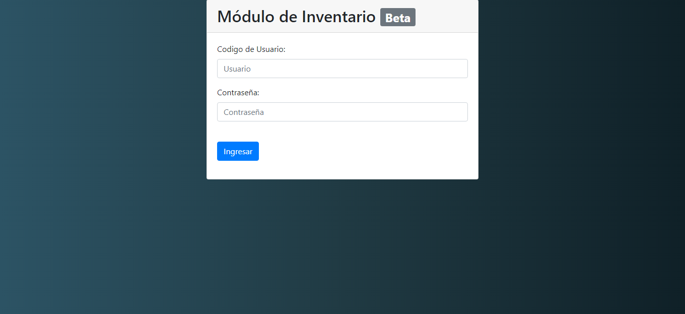
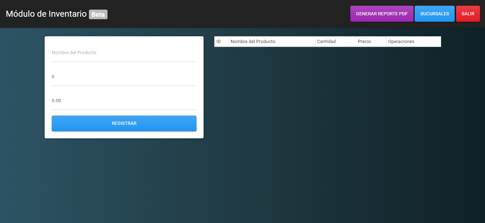
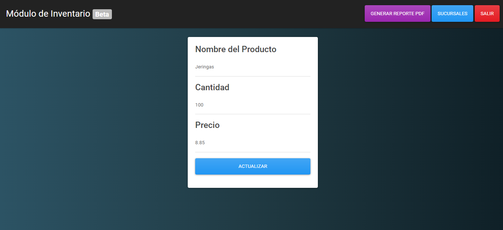
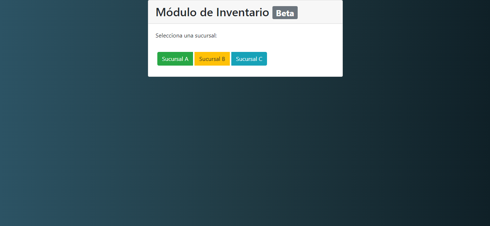

<h1 align="center"> Módulo de Inventario </h1> <br>


# :camera: Capturas de la aplicación
<!-- 


-->

Login       |  Principal | Editar       |  Sucursales
:-------------------------:|:-------------------------:|:-------------------------:|:-------------------------:
 || |


# :pencil: Recursos utilizados
```bash
- Python 3.9.5
- Flask 2.0.1
- MySQL 8.0.25
```

# :file_folder: Dependencias necesarias ha instalar
```bash
- pip install flask
- pip install flask-mysqldb
- pip install fpdf 
```

# :arrow_forward: Iniciar proyecto
> Para iniciar debe crear crear la Base de Datos MYSQL con las sentencias del archivo:
```bash
BD.sql
```
> Tambien se puede utilizar la base de datos en linea mediante los siguientes datos:
```bash
Server: sql10.freemysqlhosting.net
Name: sql10415824
Username: sql10415824
Password: 3srUg3xvNn
Port number: 3306
```
> Ejecutar App.py y abrir cualquiera de los siguientes enlaces:
```bash
http://127.0.0.1:3000/
http://localhost:3000/
```
> Para ingresar se requiere los siguientes datos:
```bash
Usuario: 1
Contraseña: admin1
```

# :briefcase: Autores
```bash
- Alvarez Aguilar Luis Alonso
- Ylaquita Atencio Jorge
- Mena Rivas Andree
- Prentice Saraya Martin 
```
